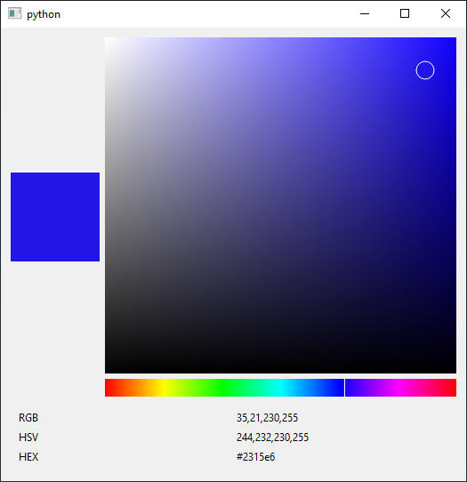

# colorpicker

colorpicker is a a color picker made with PySide6. 

Even though Qt has a color picker built in (the QColorDialog) it's visually quite bulky and uncostimzable. 
You cannot change the layout, size or customize which subwidgets are displays.

This colorpicker was made out of that frustration, to have something minimal and completely customizable. 

Tested on:
- Windows 10
- Python 3.9.0
- PySide6

Usage:
colorpicker can be run from the command prompt to give you an idea of what it looks like. 

```
python color_picker_widget.py
```



## color_picker_widget.py

### ColorPickerWidget
The "full" widget. Connect to it's ```current_color``` signal to get the current color

## hue_widget.py
### HueWidget
The horizontal "rainbow" widget, to select a color hue

## saturation_value_widget.py
### SaturationValueWidget
The "main" widget, to select the saturation and value

## color_widget.py
### ColorWidget
Just a box to show you the preview of the current color

